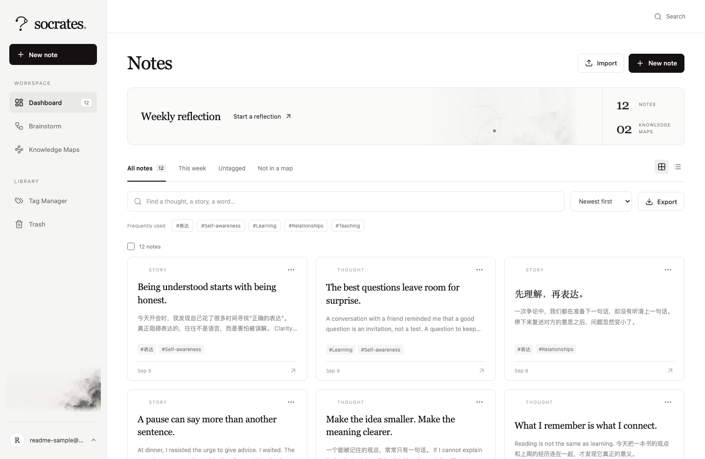
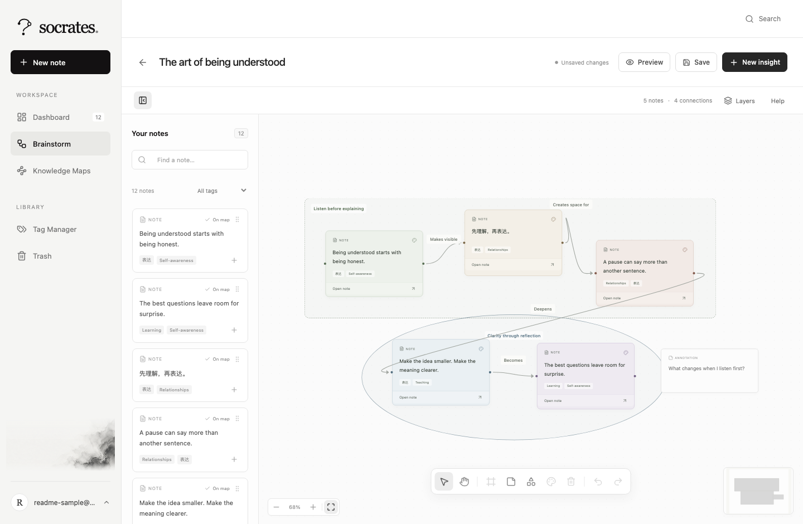
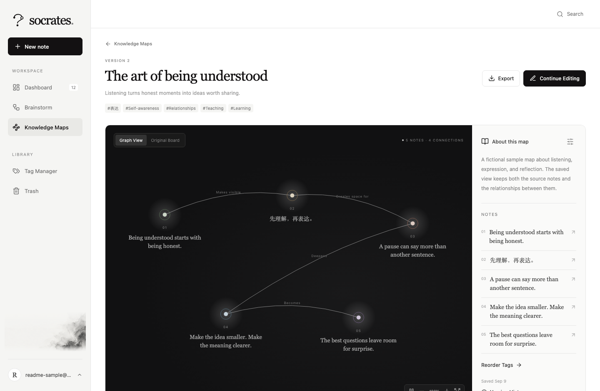
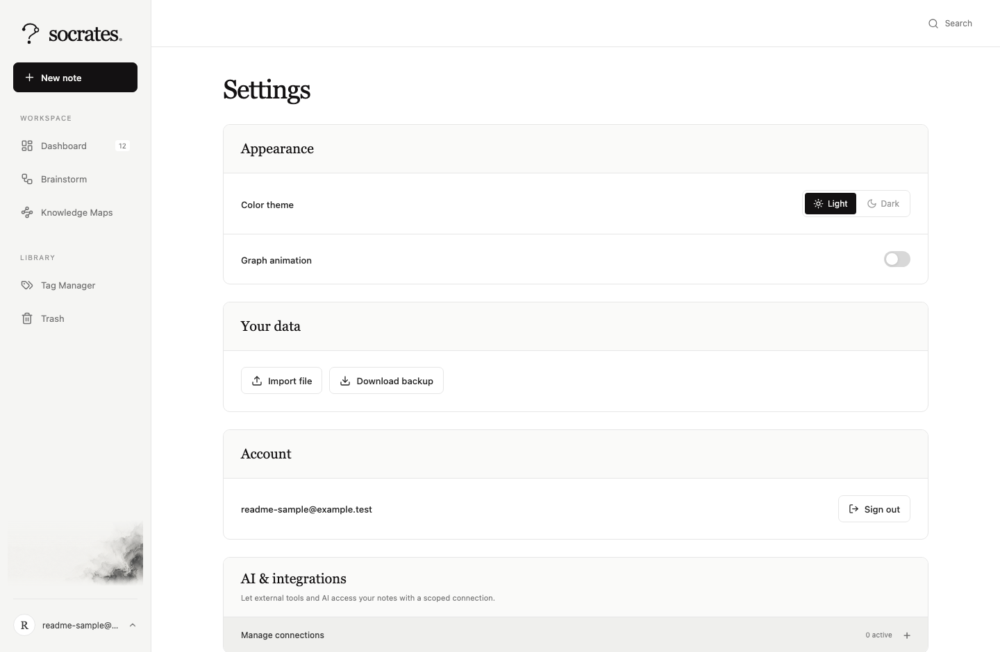
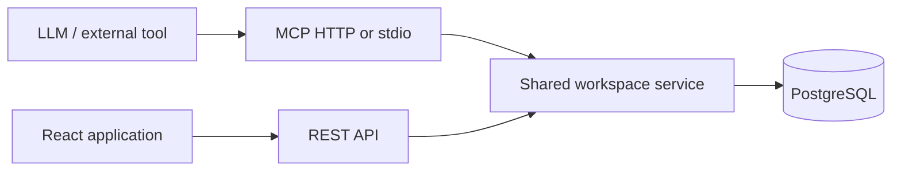

<p align="center">
  
</p>

<h1 align="center">Socrates</h1>

<p align="center">Capture a thought. Connect a story. Build something worth sharing.</p>

Socrates is a private thinking library for everyday reflections, small stories, and new insights. Turn individual notes into visual knowledge maps, revisit them during regular reflection, and reuse the results as material for courses and talks.

The interface is **English**. Notes, tags, descriptions, annotations, and connection labels support **Chinese, English, and mixed-language content**. Monochrome typography, abstract ink wash, and quiet card colors keep the focus on your ideas. The logo turns an open question into connected thoughts.

[Quick start](#quick-start) · [Pages](#pages) · [Features](#features) · [Import and export](#import-and-export) · [API and MCP](#api-and-mcp) · [Development](#development)

**Cloud app:** [Open Socrates](https://socrates-314788321213.us-west2.run.app) · [Google Cloud deployment guide](docs/GCP.md)

**Automatic deployment:** pushes to `main` run the [Deploy Socrates workflow](https://github.com/yuzhu9387/socrates./actions/workflows/deploy.yml). It tests against disposable PostgreSQL, builds a commit-specific image, and updates Cloud Run using a keyless Google Cloud identity connection.

## Quick start

Install **Node.js 22.12 or newer**, npm, and PostgreSQL command-line tools (`initdb`, `pg_ctl`, `psql`, and `pg_dump`). Then:

```sh
git clone git@github.com:yuzhu9387/socrates..git socrates
cd socrates
npm run setup
npm start
```

Open [http://127.0.0.1:3001](http://127.0.0.1:3001). Create the first account with an email and a password of at least 12 characters. Public registration closes after first-account setup; additional accounts can be added with the administrative CLI. Your library starts empty.

`setup` installs dependencies, applies migrations, and builds the application. Without an external `DATABASE_URL`, it creates a dedicated PostgreSQL cluster under `.local/postgres`, listens on `127.0.0.1:55439`, and creates separate `socrates` and `socrates_test` databases. Existing `.env` configuration is preserved. It does not change a system PostgreSQL cluster.

To use an existing PostgreSQL server, configure `.env` from [.env.example](.env.example) before setup. Provide a separate test database in `TEST_DATABASE_URL` for database and browser tests.

A [Dockerfile](Dockerfile) and [Compose configuration](compose.yaml) are also included. Create the private `deploy.env` described in the [operations guide](docs/OPERATIONS.md#docker-compose), then run:

```sh
docker compose --env-file deploy.env up --build -d
```

Docker uses PostgreSQL 17 and a persistent database volume. Remote hosting requires HTTPS; see [deployment and maintenance](#deployment-and-maintenance).

## Pages

The main navigation follows three stages: capture in **Dashboard**, connect in **Brainstorm**, and revisit in **Knowledge Maps**.

| Page or view | Route / entry | Functions |
| --- | --- | --- |
| Account setup / sign-in | Before an authenticated workspace | Create the first account or sign in to an existing library. |
| Dashboard / Notes | `/#/dashboard` | Create, read, edit, search, filter, select, copy, import, export, and trash notes. Start a weekly reflection board. |
| Note editor and reader | New note popup; note card; `/#/notes/:id` | Write a summary, tags, and Markdown details; read/edit existing notes and follow map references. |
| Brainstorm library | `/#/brainstorm` | Search maps, filter drafts/saved maps, create a whiteboard, edit, export, or move a map to Trash. |
| Whiteboard | `/#/brainstorm/:id` | Place notes, create insights, draw regions, group objects, route connections, arrange layers, preview, and save a knowledge map. |
| Knowledge Maps | `/#/maps` | Browse saved structures, search, switch map filters, and open a map for review. |
| Knowledge map detail | `/#/maps/:id` | Explore the animated graph or frozen Original Board, inspect content, manage versions, export, and continue editing. |
| Tag Manager | `/#/tags` | Create, search, rename, and delete tags; inspect usage and open associated notes. |
| Trash | `/#/trash` | Inspect deleted notes/maps, restore them, or permanently delete eligible content. |
| Settings | Click the avatar; `/#/settings` | Appearance, animation, data import/backup, account sign-out, and AI connections. |
| Global search | Header Search button or **⌘F / Ctrl+F** | Open a focused search dialog and find notes across the library. |
| Missing page | Unrecognized route | Return to Dashboard from the fallback page. |

The screenshots below use fictional bilingual sample content created in an isolated test database.



*Dashboard — capture and organize bilingual notes.*



*Brainstorm — arrange source notes, connections, regions, and annotations on the whiteboard.*



*Knowledge Map — revisit a saved version in Graph View.*



*Settings — control appearance, transfer backups, manage the account, and create scoped connections.*

## Features

### Capture and organize

- Create a note in a centered popup with a required **one-line summary** (up to 160 graphemes), **tags**, and **Markdown details**. Switch between Write and Preview while editing.
- Read full notes, edit existing content, and see which maps reference a note.
- Add tags freely, with the five most-used tags and matching suggestions as you type. Tag matching ignores case and normalizes Unicode compatibility variants; renaming to an existing tag merges current associations while saved versions stay frozen.
- Search, filter by tag, and switch between **All notes**, **This week**, **Untagged**, and **Not in a map**.
- Sort by creation date and switch between grid and list layouts.
- Select individual notes or all notes in the current result set for **Copy**, **Export**, **Add to map**, or **Delete**. Add them to an existing map or create a new one.
- Start a **Weekly reflection** board from up to five notes in the active library, then choose and arrange material on the canvas.
- Move notes to Trash and restore them later. Removing a card from a board keeps its source note in the library.

### Think on the whiteboard

The canvas uses **React Flow** with custom cards, curved connections, regions, and editing controls.

| Tool | Behavior |
| --- | --- |
| Note library | Search/filter notes on the left; drag a card onto the canvas or use its add button. Cards show summaries and tags. |
| New insight | Create a source note directly from the board and place it on the canvas. |
| Selection and movement | Drag cards/regions, select multiple objects, pan, zoom, reset to 100%, and fit the board in view. |
| Minimap | Navigate the canvas through a pannable, zoomable overview. Canvas zoom ranges from 15% to 200%. |
| Connections | Drag between card handles. Smooth curves support draggable bend points, additional bends, and a reset action. |
| Relationship labels | Double-click a line or label to edit in place, or use the connection Properties panel. |
| Card colors | Apply Paper, Sage, Sand, Clay, Slate, or Lilac to one or several cards. Color belongs to each card instance, so a source note can have different visual roles in different maps. |
| Groups | Group selected objects, name and move the group, and ungroup it. |
| Annotations | Add and edit standalone text on the board. |
| Regions | Draw rectangles/ellipses; hold Shift for a square/circle. Resize, label, recolor, change shape, and choose solid or dashed outlines. |
| Layers | Select covered objects/connections; move objects forward/backward or to the front/back. |
| Undo and redo | Revert/reapply canvas geometry, colors, labels, grouping, and layer changes. Keeps up to 60 in-memory checkpoints for the current editing session. |
| Preview and save | Save a named knowledge-map revision with a summary, description, tag relevance order, and presentation note order. |
| Help | Open the compact whiteboard controls panel. |

Pointer movement stays inside the canvas runtime. Durable workspace updates happen at the end of a gesture, avoiding a network save for every pointer move. See [performance notes](demo/PERFORMANCE.md) for measurements and their limits.

### Review and reuse knowledge maps

- Browse graph previews, summaries, tags, note counts, and draft/saved status.
- Give a map a name, one-line summary, and detailed description.
- Combine tags from source notes and manually order them by relevance.
- Arrange presentation note order independently of visual layout.
- Switch between the animated **Graph View** and the saved **Original Board**. Graph View derives a presentation layout; Original Board preserves the saved canvas arrangement.
- Inspect saved notes and board elements, open a source note's current version, toggle animation, and enter fullscreen.
- Continue editing the draft from the detail view, including by double-clicking the saved board.
- View saved revisions, edit version labels, restore an earlier structure, or delete a version.
- Export saved material for a course outline, talk, or document.

**Drafts and saved maps are different:** changing a source note updates its live references; a saved revision retains the words and structure captured when saved. Restoring a revision restores the draft structure/order while retaining current source-note content. Save again to capture a new version.

### Appearance, account, and connections

- Light/dark themes share monochrome components and an abstract ink background.
- Disable graph animation in Settings.
- Click the avatar to open Settings directly, including on mobile. Change themes under Appearance.
- Create named AI/API connections with explicit scopes, copy a new token once, rename connections, and revoke access.
- Successful background synchronization stays quiet. Saving, offline, conflict, and failure states provide status or recovery actions.

## Import and export

Copy selected notes as **Markdown** to the clipboard. If clipboard access is unavailable, a selectable-text dialog provides a fallback. Export selected notes, all notes in the current result set, or saved-map material.

| Format | Import | Export / use |
| --- | --- | --- |
| Markdown `.md` | Notes with supported metadata and Markdown content | A Markdown document with chosen notes |
| Plain text `.txt` | A note from the text | Use Markdown export or clipboard copy |
| Word `.docx` | Body text becomes one note; headings/tables become Markdown-like text. Images/embedded files and headers/footers/footnotes/endnotes are omitted with warnings. | A genuine Word document |
| Excel `.xlsx` | Notes from supported workbook columns | A genuine workbook; map exports also include structure and instance metadata |
| JSON `.json` | Supported note records or a validated Socrates backup | Local recovery downloads use JSON |
| Markdown ZIP `.zip` | An archive containing Markdown files | Use Markdown export for notes |
| Socrates backup `.socrates.zip` | Validated full workspace restore | Notes, tags, maps, geometry, colors, layers, saved versions, and preferences |

Ordinary note imports create new copies. A full backup restore explicitly replaces the current workspace; the original file remains intact. Backups also preserve items in Trash. Files are parsed and previewed before applying changes. The file-size limit is **30 MiB**, with a 64 MiB expanded-data limit, 2,000 archive entries, and up to 10,000 imported notes. These are validation limits, not throughput guarantees.

Use a **Socrates backup** to preserve the complete editable workspace. Word and Excel are useful for sharing, but importing them does not reconstruct all formatting, map geometry, or saved revisions. Content backups exclude account passwords, sessions, and API tokens.

Settings → **Your data** provides **Import file** and **Download backup**. Port 4173 and port 3001 have separate browser storage; transfer content between the prototype and application by downloading a backup from one origin and importing the file into the other.

## Keyboard and canvas controls

| Action | Shortcut / gesture |
| --- | --- |
| Global note search | **⌘F / Ctrl+F**; input receives focus automatically |
| New note | **⌘J / Ctrl+J** when no modal is open |
| Save an open note editor | **⌘Enter / Ctrl+Enter** |
| Undo a canvas edit | **⌘Z / Ctrl+Z** |
| Redo a canvas edit | **⌘Shift+Z / Ctrl+Shift+Z**, or **⌘Y / Ctrl+Y** |
| Remove selected board objects | **Delete / Backspace** outside text fields |
| Add to canvas selection | **Shift-click** |
| Draw a square or circle | Hold **Shift** while drawing |
| Edit a connection label | Double-click line/text; **Enter** saves, **Escape** cancels |
| Adjust a focused connection bend | Arrow keys: 10 board units; **Shift+arrow**: 1 unit |
| Close a dialog or leave a drawing operation | **Escape** |

Search preserves an already open editing dialog. Text-field and Chinese IME composition handling protect in-progress input from canvas shortcuts.

Global search matches summary, body, and tags and shows up to seven results; Dashboard search matches summary and body. Both use text matching rather than semantic search. Scrolling pans the canvas and pinching zooms it; a double-click on a card opens its source note.

## Storage and architecture



| Layer | Implementation |
| --- | --- |
| Frontend | React 19, Vite, React Flow, Lucide icons, shared CSS theme variables |
| Content/files | Sanitized Markdown rendering; client-side DOCX, XLSX, JSON, and ZIP processing |
| Server | Node.js and Express; versioned REST routes and shared domain services |
| Database | PostgreSQL, SQL migrations, transactions, and owner/map foreign keys |
| Authentication | Email/password login, salted scrypt password hashes, HttpOnly cookie sessions |
| AI integration | Official Model Context Protocol SDK; Streamable HTTP and local stdio |

Notes, tags, maps, card instances, edges, and revisions have distinct identities and relationships. A card references a source note; multiple cards can reuse one note. Immutable revisions intentionally store frozen note content. Services and database constraints enforce account ownership and cross-map references.

**PostgreSQL is authoritative.** Default local database files live in `.local/postgres`; Docker uses the `postgres_data` volume. The hosted app uses the independent `socrates` database on Cloud SQL in `us-west2`. Local and hosted libraries do not automatically synchronize. Browser storage holds account-specific recovery drafts and the separate legacy prototype, not the application's primary database.

Changes use workspace revisions and idempotency keys. A stale write pauses with a conflict instead of silently overwriting another client. Download local changes before deliberately reloading server data. Requests are pinned to the displayed account so another tab's sign-in change cannot redirect pending edits into a different account.

## API and MCP

The UI, REST clients, and LLM tools use the same workspace services and permission checks.

- REST root: **`/api/v1`**.
- MCP Streamable HTTP endpoint: **`/mcp`**.
- Local MCP adapter: **`server/src/mcp-stdio.mjs`**.
- **50 typed MCP tools** cover workspace status, notes, tags, maps, nodes, edges, revisions, Trash, preferences, and activity.
- Object APIs provide list/read/create/update/delete operations appropriate to each lifecycle. Activity is generated by operations and supports reading/deletion through the API and MCP only; it is not an arbitrary editable log or a Settings view.
- Ownership, relation validation, revision checks, and scopes apply to external changes too.

Open **Avatar → Settings → AI & integrations → Manage connections** to create a token:

| Scope | Access |
| --- | --- |
| `read` | Read and search |
| `read` + `write` | Create/edit content and move eligible objects to Trash |
| `read` + `write` + `purge` | Also permanently remove eligible content and replace a workspace backup |

Tokens appear once and are stored only as hashes. Rename or revoke connections in Settings. Tokens cannot create other tokens or change account credentials.

Configure the generated token in an MCP client to authorize that client to act on the account that created it. Every tool call goes through the same authentication, ownership, validation, revision, and scope checks as the REST API; the client receives no direct SQL access or database credentials.

The [API and MCP guide](docs/API-MCP.md) contains route tables, request examples, revision/error handling, and MCP client configuration. Clients need bearer-token support or the stdio adapter; this release does not provide an OAuth authorization server.

## Development

```text
demo/src/            React application, whiteboard, themes, import/export
demo/tests/          Frontend state, geometry, domain, and transfer tests
demo/scripts/        Browser interaction and performance checks
server/src/          Authentication, REST, workspace services, and MCP
server/migrations/   Versioned SQL schema migrations
server/tests/        Database, API, ownership, and real MCP-client tests
scripts/            Setup, local PostgreSQL, backups, and app browser tests
deploy/             Database initialization and reverse-proxy example
docs/               Guides, design specifications, plans, and logo asset
```

| Command | Purpose |
| --- | --- |
| `npm run setup` | Install dependencies, prepare DB, migrate, and build |
| `npm start` | Serve the built application/API on port 3001 |
| `npm run dev` | Run the server in watch mode |
| `npm run build` | Build the application into `demo/dist-app` |
| `npm run migrate` | Apply pending SQL migrations |
| `npm run db:status` | Inspect the dedicated local PostgreSQL cluster |
| `npm run db:start` / `npm run db:stop` | Start/stop that cluster |
| `npm run backup:db` | Create a full PostgreSQL dump in `backups/` |
| `npm test` | Run frontend, database, API, and MCP tests |
| `npm run test:e2e` | Run browser flows in an isolated test workspace |
| `npm run mcp` | Run stdio with its required environment configured |

For frontend development with hot reload, stop an existing server on port 3001 and run these in separate terminals:

```sh
# Terminal 1: allow the frontend development origin
APP_ORIGIN=http://127.0.0.1:4173 npm run dev
```

```sh
# Terminal 2: run the database-backed frontend
npm --prefix demo run dev -- --mode app
```

Vite serves port 4173 and proxies `/api` and `/mcp` to port 3001. The database must already be running. Keep the configured origin aligned with the browser URL so authenticated mutations pass the origin checks.

The [original prototype](demo/README.md) is retained: `npm --prefix demo run dev` without `--mode app` runs an independent localStorage workspace. `npm --prefix demo run build` creates standalone `demo/dist/index.html`. Generated builds, runtime test screenshots, dependencies, local databases, secrets, and dumps are excluded from Git. The four curated README screenshots are checked in; reproduce them with `node --env-file=.env scripts/capture-readme.mjs` using an isolated test database and an installed Chromium browser.

### Verification

```sh
npm test
npx playwright install chromium
npm run test:e2e
```

Database/browser tests require `TEST_DATABASE_URL` and isolated schemas. Browser fixtures do not reset the user's account or prototype data. Set `CHROMIUM_EXECUTABLE=/path/to/chromium` to use an existing installation.

The suite includes **47 frontend tests**, **30 server/database/API/MCP tests**, and **13 browser scenario groups**. Coverage includes bilingual persistence, revisions, imports, conflict recovery, token revocation, account isolation, proxy-aware rate limiting, MCP loopback routing, search, Settings navigation, and responsive light/dark layouts. See [verification details](docs/PRODUCTION-QA.md).

## Deployment and maintenance

The [operations guide](docs/OPERATIONS.md) covers Docker, HTTPS, migrations, backups/restores, adding accounts, and password resets.

The [Cloud Run guide](docs/GCP.md) covers the hosted deployment in Google Cloud project `leonas-friends`: a dedicated runtime identity, Secret Manager, an isolated Cloud SQL database, private initialization, verification, and upgrades. Sharing a Cloud SQL instance with Avery does not share application accounts or sessions.

For remote hosting, set `APP_ORIGIN=https://your-hostname`, `NODE_ENV=production`, and use an HTTPS reverse proxy with a private database connection. The app rejects a production HTTP origin. Health checks are `/api/v1/health/live` and `/api/v1/health/ready`.

This release targets personal libraries. It loads a complete workspace and serializes writes with a workspace-wide revision; unrelated simultaneous edits can conflict. It is not a realtime collaborative editor, and large-library throughput has not been established. Shared Avery/Socrates login, public signup, email-based recovery, automatic AI generation, and slide-deck generation are not implemented. The cloud database inherits the instance's existing automated backups; local installations need their own offsite backup process. Exports and saved maps provide material for creating courses and talks in other tools.

## Design documents

- [System design](docs/superpowers/specs/2026-09-08-socrates-system-design.md)
- [UI/UX designer prompt](docs/uiux-designer-prompt.md)
- [Production specification](docs/superpowers/specs/2026-09-09-production-app.md)
- [Production implementation plan](docs/superpowers/plans/2026-09-09-production-app.md)
- [Concise interface specification](docs/superpowers/specs/2026-09-09-concise-interface.md)
- [API and MCP guide](docs/API-MCP.md)
- [Operations guide](docs/OPERATIONS.md)
- [Google Cloud deployment](docs/GCP.md)
- [Verification report](docs/PRODUCTION-QA.md)

Design documents may include future targets. The features and boundaries above describe the implemented application.
