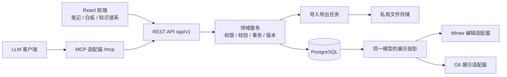
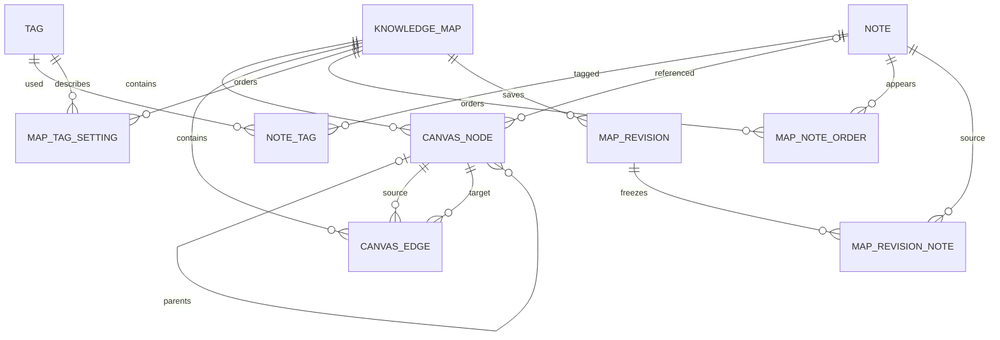
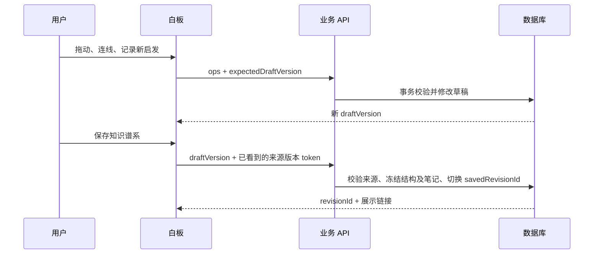

# Socrates：日常思考与课程素材库系统设计

设计日期：2026-09-08 · 状态：供评审的设计提案，尚未实现

## 1. 产品方向与设计假设

产品主线：**随手记录 → 定期回看 → 白板建立联系 → 保存主题知识谱系 → 用于课程与演讲。**

三个一级导航固定为 **Dashboard、Brainstorm、Knowledge Maps**。知识谱系详情、标签管理、回收站、导入导出、MCP 连接管理作为子路由或抽屉，不增加一级产品页面。

已确认的语言要求：**产品界面全部使用英文；所有用户内容支持中文、英文及中英文混合。** 这份设计文档继续使用中文说明业务，文中的中文功能描述不是待上线的 UI 文案。笔记、标签、主题名称、说明、连线文字和分组名保留用户输入的语言，不自动翻译。数据库表名、字段名、API 字段及内部枚举使用英文，字段内容不限制为英文。

当前方案假设个人账号、私有云端保存、电脑和手机同步；桌面优先整理白板，手机优先记录与查阅。离线暂存未发送的笔记草稿，不承诺第一版完整离线编辑与自动合并白板。此保存方式为设计假设，可替换为本地部署。

用户给出的两张图片只用于色彩参考。采用黑白灰与抽象水墨质感，不照搬图片内的花朵、山水、亭台、社交媒体界面或文案。

第一版完整覆盖笔记、白板、谱系、导入导出、API、MCP。课程编排、幻灯片生成、语义搜索、自动总结、多用户实时协作作为后续扩展；当前模型保留来源与展示顺序，足以开始积累演讲素材。

## 2. 三个页面与导航

| 一级页面 | 路由 | 主要任务 | 辅助入口 |
|---|---|---|---|
| Dashboard | `/notes` | 捕捉、检索、编辑和批量导出笔记 | 笔记详情抽屉、标签管理、复盘筛选、回收站 |
| Brainstorm | `/brainstorm`、`/brainstorm/:mapId` | 打开草稿，把笔记拖入白板并建立结构 | 草稿列表、笔记库、节点/连线列表、属性面板 |
| Knowledge Maps | `/maps`、`/maps/:mapId` | 浏览整理成果，以图谱形式展示、复用素材 | 版本历史、标签排序、原始白板视图、继续编辑 |

`/notes/:noteId` 是可直接访问的地址；从应用内打开时呈现抽屉，刷新和 MCP 返回的链接都能正确定位。全局设置以侧栏底部按钮打开，包含导入导出、个人偏好、连接管理与回收站。

### 英文界面文案基线

| 场景 | 固定英文文案 |
|---|---|
| 笔记列表及字段 | Notes、New Note、One-line summary、Details、Tags、Occurred on |
| 全局操作 | Search notes…、Save、Cancel、Edit、Delete、Import、Export、Copy as Markdown |
| 笔记阅读 | Read more、Full text、Open Note |
| 标签与筛选 | Frequently used、Create “{tag}”、Untagged、Unused、Match any、Match all |
| 复盘 | Last 7 days、Last 30 days、Not in a map、Add to Map、New Map |
| 选择范围 | Select page、Select all results、Select all notes |
| 白板 | Drafts、Untitled board、Note Library、Properties、Layers、Nodes、Connections |
| 白板工具 | Select、Connect、Group、Ungroup、Text、Draw、Undo、Redo、Fit to View |
| 白板笔记动作 | New Insight、Add to Board、Add Another Reference、Convert to Note |
| 保存与状态 | Saving…、Saved、Pending sync、Save failed、Save Knowledge Map、Update Knowledge Map |
| 谱系详情 | Graph View、Original Board、Original Layout、Explore Layout、Continue Editing、Full Screen |
| 主题资料 | Map name、One-line summary、Description、Reorder Tags、Note Order、Version History |
| 草稿与恢复提示 | Draft updates available、Editing latest draft、Restore Structure、Restore with Copies |
| 设置 | Settings、Tag Manager、Trash、Transfers、Connections、Activity |

菜单、表单、提示、空状态、错误消息、确认框、无障碍标签，以及嵌入的白板组件工具栏均使用英文资源。模板中的 `{tag}` 等插值保持原文，例如 `Create “学习”`。导出文件的系统标题/列名为英文，用户内容保持原语言。

### 2.1 Dashboard：记录与复盘

```text
┌────────────────┬──────────────────────────────────────────────────┐
│ Socrates       │ Search notes…          Import  Export  + New Note│
│                ├──────────────────────────────────────────────────┤
│ ● Dashboard    │ All / Last 7 days / Untagged / Not in a map       │
│ ○ Brainstorm   │ Frequently used: #表达 #Learning #关系 #AI #故事  │
│ Knowledge Maps ├──────────────────────────────────────────────────┤
│                │ □ 真正阻碍表达的，往往是害怕被误解。              │
│                │   #表达 #Self-awareness                           │
│                │   今天开会时……          Read more   Edit · More  │
│                ├──────────────────────────────────────────────────┤
│ Tag Manager    │ □ A small story about patience                   │
│ Trash          │   #故事 #Growth                                   │
│ Settings       │   Today I noticed…                               │
└────────────────┴──────────────────────────────────────────────────┘
```

**笔记结构与编辑**

- `summary`：一句话摘要，必填；中文、英文和混合文本采用相同上限 160 个用户可感知字符（grapheme clusters），不按字节或英文单词计数。字段标签为 `One-line summary`，不再增加重复的 title 字段。窄屏视觉省略，悬停、详情及导出始终给出完整摘要。
- `body_md`：完整 Markdown 正文，可空；支持段落、标题、列表、引用、链接、代码块和表格。摘要单独输入，正文不会被自动总结覆盖。
- `tags`：自由多选标签，可在输入时直接创建。
- `occurred_at`：可选的故事发生时间；默认记录时间。`created_at`、`updated_at` 由系统维护。
- Dashboard 卡片默认显示摘要、标签、正文前几行，可点击 `Read more` 单卡展开全文，也可切换 `Full text`。新建和编辑抽屉提供完整正文编辑器。

新建打开轻量抽屉，焦点进入一句话；`Cmd/Ctrl+Enter` 保存，保存后可继续记录。第一笔保存前使用本地临时草稿，避免每按一个键就在数据库创建空对象。正式笔记编辑以版本校验自动保存，页面明确显示 `Saving… / Saved / Pending sync / Save failed`。中文输入法正在组字时暂停自动保存和提交快捷键，确认输入后重新开始计时。

**标签建议的确定规则**

1. 标签输入框获得焦点且内容为空时，主动显示当前用户使用最多的 Top 5 标签。
2. 使用量 = 关联的未删除笔记数；同一笔记计一次。并列按最近使用时间，再按规范化名称排序。
3. 输入后按相同 normalized_name 规则优先返回名称前缀匹配，其次包含匹配；没有精确匹配时显示 `Create “{tag}”`。建议不限制自由创建。
4. `name` 保留用户显示拼写（仅清理首尾空白及输入用的开头 `#`）；单独生成 `normalized_name`，应用 Unicode NFKC 与统一大小写比较。标签在用户范围内规范化名称唯一，例如 `AI` 与 `ai` 指向同一标签；`学习` 与 `Learning` 保持两个标签，除非用户主动合并。摘要和正文不应用这种归一化改写。
5. 标签管理支持新建、改名、查看关联笔记、合并、删除。零引用标签仍出现在 `Unused` 列表，避免不可见数据。
6. 若以后需要 `人物/`、`主题/` 等前缀，它们首先是标签名称约定；第一版不把自由标签变成强制分类树。

**检索与定期复盘**

搜索覆盖摘要和正文，可按多个标签、记录日期、故事发生日期、是否已加入谱系过滤；多标签明确切换 `Match any`／`Match all`。第一版搜索支持中文连续子串、英文不区分大小写的子串及中英混合查询；一两个汉字的查询也必须有正确结果，不能只依赖三元组索引或假定英文全文检索配置能正确分词。搜索用的规范化文本是可重建的索引投影，不改写原文；中英文通用不默认包含自动翻译、拼音或跨语言语义检索。

`Last 7 days`、`Last 30 days`、`Untagged`、`Not in a map` 是可重复使用的筛选预设。选中一组笔记后可 `Add to Map / New Map`，构成定期复盘入口，无需增加第四个复盘页面。

批量栏提供：复制 Markdown、导出、添加/移除标签、加入白板、移入回收站。全选明确区分「本页」「当前筛选结果全部」「全部笔记」，显示数量；清空筛选会清空或重新确认选择范围。

### 2.2 Brainstorm：从素材到结构

```text
┌─────────────────────────────────────────────────────────────────────────┐
│ ← Drafts  表达与被理解        Saved     Preview      Save Knowledge Map  │
├────────────────┬───────────────────────────────────────┬────────────────┤
│ Search notes…  │                                       │ Properties     │
│ Filter by tags │ ┌─ 表达的阻碍 ────────────────────┐    │ Layers         │
│                │ │ [一句话 A] ─ Causes → [Idea B]  │    │                │
│ 一句话 A       │ │ #表达                 #Learning │    │ Open Note      │
│ #表达 #故事    │ └─────────────────────────────────┘    │ Group          │
│       Drag →   │                    │ Inspires         │ Connection     │
│ Idea B         │              [+ New Insight]          │ Nodes          │
│ #Learning      │                                       │ Connections    │
├────────────────┴───────────────────────────────────────┴────────────────┤
│ Select  Connect  Group  Text  Draw   Undo/Redo       − 100% + Fit to View │
└─────────────────────────────────────────────────────────────────────────┘
```

桌面左笔记库建议宽 280px，右属性面板约 320px、可收起，画布占据剩余空间。左侧列表和画布笔记卡只显示一句话与标签；正文通过 `Open Note` 抽屉访问。

| 操作 | 预期行为 | 写入对象 |
|---|---|---|
| 左侧拖入笔记 | 在落点新增一个笔记引用；笔记仍保留在素材库 | CanvasNode |
| 再次拖入同一笔记 | 默认定位已有卡片；显式「再放一个引用」可重复放置 | 新 CanvasNode，同 Note |
| 拖动/缩放/多选 | 使用 SDK 的选择与变换能力；结束手势后提交变更批次 | 节点布局 |
| 从卡片拖出连接 | 连接另一笔记卡；可设置方向、关系类型、说明 | CanvasEdge |
| 编组 | 建立具名容器，可移动、改名、调整成员、解组 | kind=group 的节点及 parent_id |
| 空白处新建／工具栏新启发 | 输入摘要、标签、正文，一次事务创建笔记并放到落点 | Note + CanvasNode |
| 打开并编辑笔记 | 编辑原始笔记；所有草稿引用可读到最新内容 | Note |
| 从白板移除卡片 | 删除当前引用及其相关连线，原笔记仍存在 | CanvasNode + 关联 CanvasEdge |
| 保存为知识谱系 | 补充主题名、一句话、详细说明和标签顺序，保存一个展示版本 | Map + MapRevision |

关系第一版提供 `Related to`、`Supports`、`Counterexample`、`Inspires`、`Causes`、`Builds on` 快捷值，内部保存稳定英文 key；自定义连线标签和说明可用中文、英文或混合文字。系统不把“连线”自动推断为已验证的事实。默认禁止自环；同一端点对允许不同关系类型，完全相同的方向、端点、关系类型不重复创建。

具名容器使用 frame／自定义容器形状，普通快捷编组可映射到 group。第一版业务连线只连接笔记卡；分组仅组织内容，不作为知识关系端点。tldraw 的普通 group 没有独立可见样式，也不能直接绑定箭头，不能把它当成现成的可连线主题簇。[tldraw Groups](https://tldraw.dev/sdk-features/groups)

注释文字、画笔笔迹也作为有 ID 的画布元素保存；在图层列表中可查找、编辑、删除。注释不自动成为独立笔记，也不进入标签聚合；「转为笔记」才创建真正的 Note。

**保存、恢复与历史**

- 新白板一创建就有 `mapId`，出现在 Brainstorm 的 Drafts 列表；未命名时显示 `Untitled board · {date}`。空白草稿可以删除。
- 白板操作即时响应，拖动结束后合并提交，编辑停止约 800ms 后刷新保存状态。保存成功必须等服务端响应。
- `Cmd/Ctrl+S` 刷新当前草稿；`Save Knowledge Map / Update Knowledge Map` 额外创建不可变展示版本。只有后者改变谱系展示内容。
- 撤销/重做主要作用于当前白板操作；撤销卡片的放置不删除已创建的原始笔记。笔记正文编辑是独立事务，不伪装成可安全回退的画布拖动。
- 冲突不会默默覆盖：保留本地未提交操作，显示最新版本，允许重新应用或丢弃本地改动。
- 手机使用 `Add to Board` 按钮替代必须拖拽；可以浏览和小幅调整，大规模结构整理优先桌面完成。

### 2.3 知识谱系：整理成果与展示

列表支持网格／列表切换、主题搜索、聚合标签筛选、最近整理排序。每项包括主题名称、一句话、优先级最高的标签、去重后的笔记数、保存时间、图谱缩略图。缩略图仅在悬停时短暂播放动画，避免列表同时运行大量画布。

**详情页是同一张知识结构的展示模式**：

```text
┌────────────────────────────────────────────────────────────────────────┐
│ ← Knowledge Maps  表达与被理解  v3 · Saved Sep 8   Continue Editing  ⋯ │
│ One-line summary: 表达的突破，从容许误解开始。                          │
│ #表达 #Self-awareness #故事                             Reorder Tags   │
├───────────────────────────────────────────────┬────────────────────────┤
│                                               │ Description            │
│       ○───────○                               │ 把经历转化为理解……     │
│        ╲    ╱   ╲                             │                        │
│          ◎───────○                            │ Notes                  │
│        ╱   ╲                                  │ 一句话 A               │
│      ○       ○                                │ Idea B                 │
│                                               │ Open Note              │
├───────────────────────────────────────────────┴────────────────────────┤
│ Graph View / Original Board    Original Layout / Explore Layout         │
│ Focus                                                 Full Screen Export│
└────────────────────────────────────────────────────────────────────────┘
```

- 默认图谱展示保留保存版本中的节点中心坐标、关系和分组，用黑白图形语言呈现；不会自动改变原白板结构。
- 提供 `Original Board` 切换，用白板 SDK 的只读模式完整呈现注释、笔迹和原卡片版式。图谱展示是业务结构投影，手绘装饰不伪装成知识节点。
- 可选 `Explore Layout` 在客户端生成力导向布局，布局停止后固定。它只影响当前浏览，不回写白板。手动应用新布局必须进入编辑模式并保存。
- 悬停节点高亮一跳关系，点击节点在右侧展示一句话、标签和保存时的完整笔记；可进一步打开当前原笔记。
- 点击知识谱系列表项进入详情。双击详情中的画布背景进入**同一个 mapId 的最新草稿**；「继续编辑」按钮提供明确的键盘和触屏替代。节点双击可进入编辑并定位对应节点，禁用同一区域默认双击缩放，避免冲突。
- 当前草稿若与展示版本不同，展示 `Draft updates available`；进入时说明 `Editing latest draft`。查看旧版本后也不会误把旧版当作最新草稿。
- 主题名称、一句话、说明、标签排序都能编辑；从展示页修改时更新草稿并提供「保存展示版本」，避免只有图更新而标题还是旧版。

**知识谱系标签**

草稿的来源集合 = 当前白板中未删除的、去重后的笔记标签并集 + 手动添加的主题标签。一个笔记放三张卡，标签使用量只加一次。保存时冻结这个聚合结果；知识谱系列表、详情、标签筛选、计数与默认导出全部读取所选 MapRevision 的聚合，不混入当前笔记的新标签。展示页修改标签先更新草稿，保存新版本后才改变展示。

默认按“覆盖的独立笔记数”降序；这是透明的相关程度近似，不宣称理解语义。用户拖动标签后启用完整人工排序；新出现的标签追加在末尾并标记「新增」，直到用户调整或重置排序。

自动聚合标签显示覆盖笔记数；手工添加的主题标签可直接移除。自动标签的移除入口指向它的来源笔记，允许批量解除那些 NoteTag 关联；不能悄悄把标签从聚合结果隐藏，因为用户要求综合所有卡片标签。标签失去全部来源且不是手动添加时，删除对应排序记录；若仍为手动标签，则继续保留。

**面向课程的轻量复用**

详情中的「笔记顺序」列表支持手动排序，作为该主题的阅读和导出顺序；按去重笔记存储，与画布坐标、标签顺序分开。默认按分组顺序、组内从上到下再从左到右生成。以后增加课程大纲可引用 `mapId + revisionId + noteId`，保留准确素材出处。

## 3. 视觉系统：黑白水墨 × 科技图谱

采用浅色记录空间与深色展示空间，也允许全局手动切换。主要颜色直接取自参考图。

| Token | 色值 | 使用方式 |
|---|---|---|
| 月白 | `#F5F5F3` | 浅色页面背景、留白 |
| 素雪 | `#FFFFFF` | 内容卡片、输入区 |
| 淡灰 | `#E6E6E6` | 浅色分区和微弱网格 |
| 银灰 | `#D8D8D8` | 分隔线、非关键结构 |
| 中灰 | `#C3C3C3` | 深色模式辅助文字 |
| 烟灰 | `#A6A6A6` | 装饰和次级图线 |
| 黛灰 | `#707070` | 浅底辅助文字，发布前校验对比度 |
| 玄墨 | `#3A3A3A` | 浅色主正文 |
| 墨黑 | `#1A1A1A` | 深色卡片 |
| 深墨 | `#131112` | 主按钮、浅色标题 |
| 漆黑 | `#0D0D0D` | 图谱展示背景 |

背景仅使用抽象墨迹扩散、烟雾般的浓淡层次、极细纸张颗粒；分布在边角和大面积留白，建议透明度 3–6%。不绘制山峰、竹子、花、亭子、书法字或徽章。内容卡片保持实色底；白板工作区使用更克制的底纹，避免纹理干扰连线。

界面与正文使用同时覆盖英文和中文的字体回退链：`system-ui, -apple-system, BlinkMacSystemFont, "Segoe UI", "PingFang SC", "Microsoft YaHei", "Noto Sans CJK SC", sans-serif`；少量主题标题可使用带中英回退的衬线字体。正文建议 15–16px、行高 1.65，卡片圆角 12px，边框 1px。中文正常断行，英文长词/URL 必要时换行；根据实际字体测量图节点标签，避免按固定英文字符宽度截断中文。状态通过图标、文字、线型、明暗表达，不依赖用户未要求的彩色强调。

图谱入场设计：300–600ms 的节点渐显和连线展开；选中节点短暂光晕，镜头聚焦约 350ms。持续动画只用在选中路径，可关闭；支持 `prefers-reduced-motion`。背景不使用持续占满 GPU 的流体模拟。科技感来自精确布局、路径反馈、层次与镜头移动。

## 4. 白板与图谱组件选型

推荐方案：**tldraw 编辑白板 + AntV G6 展示图谱 + 应用自有数据模型。** 选型依据是本产品的完整白板交互和定制笔记卡需求，不把“最新”直接等同于“最好”。

| 方案 | 适合点 | 需要应用自己完成 | 许可与取舍 |
|---|---|---|---|
| tldraw | 无限画布、选择、移动、箭头绑定、分组、历史、自定义 React shape | NoteCard、笔记侧栏拖入、业务关系、云端保存、谱系管理 | 生产需有效许可；最符合完整白板优先 |
| React Flow | React 节点和连线、结构化图编辑，卡片定制直接 | 完整白板菜单、编组流程、undo/redo、部分白板行为 | 核心 MIT；适合以节点图为主、接受补齐交互的路线 |
| Excalidraw | 成熟手绘白板、图形、箭头、分组、撤销 | 笔记与标准图形映射、拖入、云保存；复杂卡片限制更多 | 编辑器包 MIT；适合无 SDK 许可预算且接受标准图形卡片 |

tldraw 提供自定义形状、绑定和保存接口；本地 `persistenceKey` 不是云端数据库同步。生产许可不能视作免费开源：个人非商业项目可申请 hobby 许可，但是否批准由官方决定，且需保留水印；商业许可为洽谈报价。本方案未假定已经取得许可，也不填写未经确定的预算。[自定义形状](https://tldraw.dev/examples/custom-shape)、[绑定](https://tldraw.dev/sdk-features/bindings)、[保存](https://tldraw.dev/docs/persistence)、[许可](https://tldraw.dev/community/license)、[定价](https://tldraw.dev/pricing)

React Flow 官方把白板能力作为需要组合的功能，并提供部分 Pro 示例；不能把它描述成完整白板成品。Excalidraw 的网站协作、本地自动保存等也不等于嵌入包全部自带。[React Flow 白板说明](https://reactflow.dev/learn/advanced-use/whiteboard)、[撤销示例](https://reactflow.dev/examples/interaction/undo-redo)、[Pro 与 MIT](https://reactflow.dev/pro)、[Excalidraw 项目与功能边界](https://github.com/excalidraw/excalidraw)

G6 提供节点、边、Combo 容器、布局及动画配置，适合做这份结构的独立展示层。本文的黑白光晕、镜头编排和入场节奏仍是应用设计工作。第一版采用保存坐标或支持 Combo 的图布局；不把 Combo 与树布局随意混用，官方提示该组合存在布局问题。[G6 配置](https://g6.antv.antgroup.com/en/manual/graph/option)、[Combo 说明](https://g6.antv.antgroup.com/en/manual/element/combo/overview)、[G6 项目](https://github.com/antvis/G6)

## 5. 系统架构

个人产品从一个模块化后端开始，部署单体即可。前后端共享契约，白板和展示层按需加载。



| 层 | 建议实现 | 责任 |
|---|---|---|
| 前端 | React + TypeScript | 三页布局、服务端状态、笔记编辑、交互状态 |
| 正文 | 现成 Markdown 编辑器及安全预览 | 以 Markdown 原文为唯一内容来源；工具栏编辑原文 |
| 白板 / 展示 | tldraw / G6 | 消费统一结构；不直接访问数据库 |
| HTTP 后端 | Node.js + TypeScript + Fastify | REST 路由、共享 JSON Schema 校验、领域服务 |
| 数据 | PostgreSQL + SQL migrations | 规范化对象、外键、事务、版本、检索 |
| MCP | 官方 MCP SDK 的薄适配层 | 把结构化工具参数映射到业务 API |
| 文件任务 | 同一代码库的 worker + 数据库任务队列 | 解析导入、生成 DOCX/XLSX/ZIP、过期清理 |
| 认证 | 受管理的 OIDC/OAuth 服务 | 浏览器会话、MCP 委托访问、连接撤销 |

Fastify 支持基于 schema 的请求校验与响应序列化，可将契约复用于 OpenAPI 和工具参数。本文不固定未经安装验证的具体版本号。[Fastify Validation and Serialization](https://fastify.dev/docs/latest/Reference/Validation-and-Serialization/)

图谱首先是关系数据与展示形式：当前对象与边能由 PostgreSQL 表达，暂不需要引入独立图数据库。搜索先使用索引和子串查询；`pg_trgm` 可辅助较长查询的相似与包含匹配，但中文短查询仍需正确的回退路径。[PostgreSQL pg_trgm](https://www.postgresql.org/docs/current/pgtrgm.html)

## 6. 数据模型：内容、实例、主题、版本分别建模

最重要的身份关系：**Note 是原始内容；CanvasNode 是它在某张图里的摆放实例；KnowledgeMap 同时承载编辑草稿与知识谱系身份。** 不另建 Board 表再复制成 Map。



### 6.1 表定义提案

实体 ID 使用 UUID，所有业务行按 `owner_id` 隔离。实体包含 `created_at`、`updated_at`；软删除对象增加 `deleted_at`。下表列出业务字段，未重复列公共字段。

| 表 | 核心字段 | 唯一性与关系 |
|---|---|---|
| `notes` | `id, summary, body_md, occurred_at, version` | 原始笔记内容；一句话作为标题 |
| `tags` | `id, name, normalized_name, version` | 用户范围内活跃 normalized_name 唯一 |
| `note_tags` | `note_id, tag_id, position` | 主键 `(note_id, tag_id)`；两端必须同 owner |
| `knowledge_maps` | `id, name, summary, description_md, draft_version, saved_revision_id?, tag_sort_mode, viewport_json` | 一个主题一个身份；无 saved revision 即未整理草稿 |
| `canvas_nodes` | `id, map_id, kind, note_id?, parent_id?, x, y, width, height, rotation, z_index, label?, props_json` | kind=`note_ref/group/annotation`；note_ref 必须有 note_id，其他 kind 必须为空 |
| `canvas_edges` | `id, map_id, source_node_id, target_node_id, relation_type, label, description_md, directed, props_json` | 两端必须为同图 note_ref；FK 保证节点存在 |
| `map_tag_settings` | `map_id, tag_id, manual_added, rank?` | 主键 `(map_id, tag_id)`；只存手工添加/排序覆盖，不存第二套自动频次 |
| `map_note_order` | `map_id, note_id, rank` | 主键 `(map_id, note_id)`；主题内去重笔记的讲述顺序 |
| `map_revisions` | `id, map_id, number, label, source_draft_version, schema_version, content_json` | `(map_id, number)` 唯一；保存主题资料、节点、边、标签及顺序的冻结结构 |
| `map_revision_notes` | `revision_id, note_id, note_version, summary, body_md, tags_snapshot` | 主键 `(revision_id, note_id)`；冻结该版本的去重笔记内容，保留原始 Note FK |

当前正文只有 notes 一份。`map_revision_notes` 的副本是明确的历史快照，不参与当前编辑。快照中的标签保留当时的 ID 和显示名称，标签以后改名也不会改写既有演讲素材。

系统持久记录另外包括 `user_preferences`、`transfer_jobs`、`activity_events`、`idempotency_records`：分别用于主题/时区等偏好、可查询和删除的导入导出任务、操作来源记录、请求重试去重。任务拥有 `transfer_job_notes(job_id, note_id, note_version, content_json)` 临时快照行，主键 `(job_id, note_id)`，外键关联任务及原笔记；用于冻结实际导出内容，可从任务预览访问，随任务删除。会话与 OAuth 凭据由认证服务管理；UI 提供连接列表、授权范围和撤销入口。

### 6.2 数据库与服务端不变量

1. 同一笔记可出现在多个图，也可在一图内重复出现；移动卡片不改笔记正文。
2. `parent_id` 必须指向同图 group；不允许自父级或循环嵌套。坐标以画布世界坐标为应用规范，适配 SDK 时转换父子局部坐标；移动分组在事务中更新受影响后代的位置。
3. 边端点使用节点实例 ID，不用 Note ID。跨图边不合法。端点、父节点的同 owner、同 map 使用复合外键，kind 与循环约束由事务校验或触发器补足。
4. `saved_revision_id` 必须属于当前 map；复合外键防止主题指到其他主题的版本。
5. 所有图统计、标签频次和导出默认按 distinct Note ID 去重。
6. 人工排序提交完整 ID 列表并校验集合。新增项追加；最后一个相关节点移除时，删除其无效 note-order 记录。自动标签不再出现且非手工标签时清理过期排序设置。
7. 更新 NoteTag、标签删除、节点增删后，同一事务更新受影响主题的排序有效性和相关版本号；读取草稿时计算自动频次，展示读取冻结频次。NoteTag 的新增、删除、排序均校验并递增所属 `Note.version`，不另设关系版本；标签改名递增 `Tag.version`。
8. 跨用户 ID，即使格式正确也无法建立任何外键关系或被 API 查询到。`owner_id` 从登录身份派生，客户端不能指定要冒用的 owner。
9. 缓存、统计和 SDK 原生文档可以丢弃重建，不能成为隐藏的独立业务对象。

### 6.3 SDK 数据适配边界

结构化 `canvas_nodes` 和 `canvas_edges` 是当前图的事实来源。`props_json` 只保留经 schema 验证的渲染信息，例如笔迹点、卡片样式、箭头路由及 SDK 适配信息；其中不能另外保存可独立修改的 note_id、节点位置或边端点。

第一版支持 note_ref、具名容器／普通分组、文字注释、手绘笔迹，以及 note_ref 之间的业务连线。未纳入模型的 SDK 形状工具先不开放，不能让用户创建“能画出来但系统无法保存”的对象。

`CanvasAdapter` 负责 SDK 事件 → 领域操作、世界/局部坐标转换、绑定生成、原生文档重建和版本迁移。SDK 原生 snapshot 如用于恢复性能，只能作为带 source version 的派生缓存；版本不匹配即重建。

`GraphProjection` 只读取结构化节点、关系和容器，并与 frozen note data 合并为展示模型。换白板 SDK 或展示库时，应用数据格式保持稳定。代价是必须实现并测试适配层，不能宣称购买 SDK 后无需业务开发。

### 6.4 删除与可恢复性

| 删除动作 | 默认结果 | UI 可达性 |
|---|---|---|
| 删除白板上的卡片 | 删除这个实例及关联边，保留 Note | 撤销；原笔记仍在 Dashboard |
| 删除分组 | 解组并保留子节点世界坐标 | 分组菜单明确区分「解组」与「移除组内卡片」 |
| 删除笔记 | 笔记软删除，草稿保留可操作的占位卡 | 回收站；占位卡可恢复、替换引用或移除 |
| 删除知识谱系 | 整个 map 软删除，保留版本；不删原笔记 | 回收站可整图恢复 |
| 删除全局标签 | 软删除标签并解除活跃笔记/主题关联，展示影响数量 | 标签回收站保存删除操作的关联清单，可恢复未冲突关联 |
| 删除保存版本 | 删除该历史版本及其冻结笔记行 | 历史面板；若为当前展示版本，先指定其他版本或退回草稿 |
| 永久清除笔记 | 仍被任意草稿、历史版本或传输任务快照引用时拒绝清除，返回影响清单 | 一键跳到活跃/回收站引用及任务处理后重试 |

软删除的笔记仍有实体行，因此占位卡不是悬空外键。保存版本保留当时正文，但显示原笔记已删除的状态。保存新的展示版本前若存在这类占位卡，返回 `DELETED_NOTE_REFERENCES` 及可定位节点清单，要求先恢复、替换或移除，避免把已删除正文重新带入新版本。

永久清除的引用查询包括活跃主题、回收站中的主题、全部历史版本以及传输任务快照；不能使用默认过滤 deleted_at 的普通查询。结果为每个阻塞引用提供普通页面或回收站入口。永久清除主题时，原子删除其节点、边、排序和版本，保留共享原笔记；清除任务时删除快照与下载文件。真正永久清除笔记前必须处理这些受管副本，不能在 JSON 或下载文件里留下不可见内容。

回收站不默认自动清空；提供主动清理。活动记录只保存对象 ID、来源、操作和字段名，不记录笔记正文；删除操作需要恢复的信息随相应回收站条目保存。服务端备份的到期时间独立于应用清除，设置页说明保留策略，不能把数据库软删除宣称为立即抹除所有备份。

### 6.5 英文界面与中英文数据支持

| 层 | 必须满足的约束 |
|---|---|
| 界面语言 | 第一版固定英文 UI，应用与嵌入 SDK 明确设置英文 locale；系统提示统一来自英文资源。用户内容的语言独立于 UI locale。 |
| 数据库 | 创建 PostgreSQL 数据库时明确使用 `UTF8`，数据库连接使用 UTF-8；所有用户文本字段使用 `text` 等 Unicode 文本类型，不设置只允许 ASCII/英文的校验。部署验证 server/client encoding，不依赖机器默认值。 |
| 模型 | 同一 summary、body_md、tag.name、map.name、description、group label、edge label 字段可混写中文、英文、数字和 emoji。无需拆成中文表/英文表或 summary_zh/summary_en 两份字段。 |
| 原文与归一化 | 正文、摘要保留原文，不自动翻译、简繁转换、替换全角标点或改变字母大小写。仅标签比较键和派生搜索索引归一化；`AI`、`ai`、`ＡＩ` 命中同一个标签，沿用已有显示名称；`学习`、`學習`、`Learning` 保持独立，用户可手动合并。 |
| 字符与截断 | 摘要计数、UI 截断和应用分块使用 Unicode grapheme 边界，前后端采用一致的分段规则；不得从字节中间、emoji 组合或代理对中间截断。文件格式的长度限制另做检查，不等同于 UI 字数。 |
| 输入法 | 监听 composition 生命周期并检查 isComposing；组字期间 Enter 不提交笔记/创建标签，Delete、字母键、撤销等不冒泡成白板命令。compositionend 后重启自动保存，确认候选的同一按键不能继续触发表单提交。 |
| API / MCP | JSON 使用 UTF-8 传输，schema 字符串接受中英文；工具名、字段名与错误提示为英文，返回的笔记和标签原文不变。内容通过序列化器传输，正确处理引号、换行和 Unicode。 |
| 文件 | Markdown、JSON 和 ZIP 内文本使用 UTF-8；DOCX/XLSX 写入 Unicode 字符串并配置中英字体回退。保留中文文件名，清理路径危险字符时不把中文全部移除。 |
| 日期与排序 | UI 日期按英文 locale 与用户时区显示，数据库时间使用 timestamptz。默认按日期/使用频次排序；并列用规范化键与 ID 固定顺序，避免数据库环境改变分页结果。人工标签/笔记顺序不受 locale 变化影响。 |

PostgreSQL 的字符集在数据库创建时确定，UTF8 支持多语言文本；应用仍须正确配置连接编码。[PostgreSQL Character Set Support](https://www.postgresql.org/docs/current/multibyte.html) 浏览器输入法与字符分段可采用现成 API，具体编辑器仍需实际验收中文输入行为。[KeyboardEvent.isComposing](https://developer.mozilla.org/en-US/docs/Web/API/KeyboardEvent/isComposing)、[Intl.Segmenter](https://developer.mozilla.org/en-US/docs/Web/JavaScript/Reference/Global_Objects/Intl/Segmenter)

非 UTF-8 的旧文本导入先显示编码问题，允许明确选择源编码后预览；非法或未知字节不静默替换成乱码。备份往返按解码后的原文和结构校验；若预览中检测到有损转换，阻止正式导入。

## 7. 草稿、展示版本与并发



展示读取保存版本，白板读取最新草稿。编辑笔记会改变当前素材和草稿引用；已有展示版本仍读取冻结内容。展示页的「有待整理更新」通过比较草稿版本以及来源笔记、标签版本判定。

恢复历史必须明确内容范围：默认「恢复结构，使用当前原笔记」，恢复当时的主题信息、布局、关系和排序，并列出原笔记与快照的差异；不会把旧正文覆盖到其他图共享的 Note。若选择「连同当时内容恢复」，从冻结素材创建新的 Note，重建本图引用并返回新旧 ID 映射。已删除的原笔记在默认模式中保留可操作占位卡；复制历史素材模式可从快照独立创建新笔记。两种恢复均生成新的草稿修订，保留原展示版本，下一次保存才更新展示。

普通 Note 写入使用 `If-Match` 对应版本；NoteTag 写入也使用所属 Note 的版本。所有主题草稿写入路径，包括主题资料、单个节点/边、分组、标签设置、阅读顺序、批量操作和 MCP，必须校验并递增同一个 `draft_version`；HTTP 可用 If-Match，组合操作和工具参数使用 `expectedDraftVersion`，由 handler 归一化。版本不匹配返回 `409 VERSION_CONFLICT` 与当前版本及冲突对象，保留本地编辑，禁止自动最后写入覆盖整个图。

新增笔记并放入白板、删节点并删相关边、全量排序、保存谱系都是原子事务。保存谱系前服务端验证用户已读取的来源版本 token：包含去重 Note ID、Note.version（覆盖 NoteTag 变更）、标签关联集合与顺序、Tag ID 及 Tag.version；若 MCP 刚修改了这些内容，先刷新预览再保存。数据库事务采用一致性快照，并对需要比较的行加锁或做提交时版本校验，防止校验后、复制前又发生修改。

新建、导入提交、快照保存带幂等键；同 owner、路由、键及参数摘要的重试返回同一结果，参数不同返回冲突。拖动发送操作批次，不在每帧写数据库。UI 与 MCP 使用同一版本机制。

第一版用窗口重新聚焦时刷新及轻量版本轮询发现跨端修改；后续可添加变更事件推送。单人也可能同时开两个标签页，因此并发校验第一版就需要。

## 8. CRUD API 与 UI 对应

所有端点位于 `/api/v1`。集合一般支持 `POST` 创建、`GET` 列表；单项支持 `GET`、`PATCH`、`DELETE`。关联支持单项增删及完整集合替换。删除默认为软删除或解除关联。

这里把“所有数据库都有 CRUD”落实为：**所有用户业务对象及关系有完整生命周期，且能从 UI 操作。** 自动频次、数据库修订号、审计事实和不可变快照内容不能当作普通输入随意改写；历史内容的修改方式是恢复成新草稿再保存，版本标签可直接改名。

| 对象／关系 | API | UI 入口与 CRUD 方式 |
|---|---|---|
| Note | `/notes`、`/notes/:id` | Dashboard 和详情抽屉：新建、查看、编辑、删除 |
| Tag | `/tags`、`/tags/:id` | 标签管理：新建、查找、改名、删除；另有合并动作 |
| NoteTag | `/notes/:id/tags`、`/notes/:id/tags/:tagId` | 标签输入器：添加、读取、替换/排序、移除 |
| KnowledgeMap | `/maps`、`/maps/:id` | 草稿/谱系列表：新建、查看、主题信息编辑、删除 |
| CanvasNode | `/maps/:id/nodes`、`/maps/:id/nodes/:nodeId` | 白板及节点列表：创建/拖入、查找、更新、移除 |
| Group / Annotation | 同 Node 路由，以 kind 区分 | 容器工具、画笔/文字工具、图层列表，完整 CRUD |
| CanvasEdge | `/maps/:id/edges`、`/maps/:id/edges/:edgeId` | 连线及关系列表：建立、查看、改端点/方向/标签、删除 |
| MapTagSetting | `/maps/:id/tags`、`/maps/:id/tags/:tagId` | 主题标签面板：手动添加、读来源、排序、移除手工关联/重置排序 |
| MapNoteOrder | `/maps/:id/note-order` | 主题笔记列表：自动初始化、读取、拖动更新、重置；失效项自动清理 |
| MapRevision | `/maps/:id/revisions`、`/maps/:id/revisions/:revisionId` | 保存、历史查看、修改版本标签、删除、恢复为新草稿 |
| RevisionNote | `/maps/:id/revisions/:revisionId/notes` | 版本详情：随版本创建/读取/删除，恢复后修改内容 |
| 回收站条目 | `/trash`、`/trash/:kind/:id/restore`、`/trash/:kind/:id/purge` | 回收站：查询、恢复、永久清除及引用处理 |
| 用户偏好 | `/me/preferences` | 设置抽屉：初始化、查看、修改、重置 |
| 导入/导出任务 | `/imports`、`/exports` 及各自 `/:id` | 传输中心：创建、查看、修改未执行配置、取消/删除 |
| 任务内容快照 | `/exports/:id/notes` | 任务预览：随任务创建、读取和删除；修改选择需生成新快照 |
| MCP 连接 | `/connections`、`/connections/:id` | 设置：授权新连接、查看、改显示名/权限、撤销 |
| 活动记录 | `/activity` | 活动面板查看来源及影响对象；可清理记录，事实内容不可篡改 |

防止“有数据却摸不到”的要求：白板旁必须有节点、分组、注释、关系的可搜索列表；选中列表项可以定位、修改或删除，即使元素在屏外、重叠、隐藏或所属分组折叠。草稿、零引用标签、历史版本、回收站、传输任务均有入口。

### 8.1 关键组合接口

| 方法及路径 | 用途 |
|---|---|
| `GET /tags/suggestions?q=&limit=5` | 空查询 Top 5；输入后前缀/包含推荐 |
| `POST /tags/:id/merge` | 把来源标签合并到目标，去重关联，保留有效排序 |
| `POST /notes/batch` | 笔记批量标签/软删除，限制批量大小并返回逐项结果 |
| `POST /maps/:id/operations` | 节点、边、分组的原子操作批次 |
| `POST /maps/:id/insights` | 一次事务创建 Note 与 CanvasNode |
| `POST /maps/:id/revisions` | 校验并冻结展示版本，更新 savedRevisionId |
| `POST /maps/:id/revisions/:revisionId/restore` | 从历史生成当前新草稿，校验当前 draft version |
| `GET /notes/:id/references` | 返回草稿实例和历史版本引用，全部附 UI 链接 |
| `POST /selections/resolve` | 将显式 ID 或筛选范围解析为有期限的选择 token |
| `POST /imports/:id/commit` | 对预检通过且已选择的行正式导入 |
| `POST /exports` | 将选择与版本策略固化为导出任务 |

图相关读取显式指定 `view=draft` 或 `view=saved`，历史展示额外给出 revisionId；笔记、标签、计数和主题资料按同一 view 返回。知识谱系列表使用已保存版本字段，草稿列表使用当前字段。集合接口使用稳定 cursor 分页，返回 `items, nextCursor, total`；限制 page size。搜索排序加 `id` 作为稳定的并列排序键。统一错误包含 `code, message, fieldErrors?, currentVersion?, requestId`；缺失、越权、冲突、非法关系、解析失败有不同错误码。

`GET` 默认排除软删除数据；回收站端点可查询。所有响应可返回可点击的 `uiUrl`，让 LLM 操作后的对象立即能在 UI 打开。

## 9. 导入、复制、导出与完整备份

### 9.1 选择规则

所有复制/导出统一使用 `SelectionSpec`，可以是明确 Note ID 列表，或「筛选条件 + 排除 ID」。全选跨分页有效。提交导出时服务端在一致性事务中固定实际 ID、内容版本和顺序，并将实际摘要、正文、标签及来源写入任务拥有的 `transfer_job_notes`；不能只保存版本号后让 worker 回读最新 notes。任务运行期间新增或修改的笔记不混入同一个导出文件。导出临时快照与下载文件默认保留 7 天，传输中心可提前删除；删除或到期时一起清理，并纳入永久清除的引用检查。

Dashboard 默认导出当前笔记；谱系详情默认导出该展示版本的冻结内容，也可显式选择「当前原笔记」。两者不混用。相同 Note 默认只导出一次，顺序来自主题笔记顺序或 Dashboard 当前排序。

### 9.2 格式协议

| 格式 | 内容 | 能否完整恢复图谱 |
|---|---|---|
| 剪贴板 Markdown | 多篇笔记按顺序组合，每篇有摘要、标签、正文，篇间分隔 | 否；用于直接粘贴复用 |
| `.md` / Markdown ZIP | 单篇使用 frontmatter；多篇可选合并文件或每篇一个文件 | 笔记可还原；图关系需备份包 |
| `.docx` | 主题标题/说明，按顺序的笔记摘要、标签与格式化正文 | 文本为主；复杂 Word 排版不保证往返一致 |
| `.xlsx` | Notes、Tags、NoteTags；谱系导出另含 Maps、Nodes、Edges、MapTags、NoteOrder | 应用规定的工作簿结构可恢复受支持结构；SDK 装饰以备份包为准 |
| `.socrates.zip` | manifest、全部规范化数据、历史版本、画布渲染属性及校验和 | 是；作为完整迁移与备份格式 |

单篇 Markdown 示例：

```markdown
---
schema_version: 1
id: "7e4b09ee-2332-4e58-aec1-02942a1b00ac"
summary: "表达的突破，从容许误解开始"
tags: ["表达", "自我认知"]
created_at: "2026-09-08T20:00:00Z"
---

今天开会时，我注意到……

## 后来的想法

与其等待完美表述，不如先把核心问题说清楚。
```

实际导出用 YAML serializer 正确转义名称、冒号和换行，正文中出现 `---` 不会被错误地切成新笔记。多篇无歧义回导优先使用“每篇一个文件”的 ZIP。

DOCX 使用成熟生成库，将 Markdown AST 映射到段落、标题、列表和表格，不能只改文件扩展名。XLSX 使用成熟工作簿库，ID、Markdown、日期原文和用户输入写为字符串，不把以 `=` 等字符开头的内容当公式。[docx Packer](https://docx.js.org/api/classes/Packer.html)、[ExcelJS](https://github.com/exceljs/exceljs)

Excel 单元格最多 32,767 字符；长正文不能截断。超过限制时 Notes 行存 `body_storage=chunks`，正文完整写入 `NoteBodyChunks(note_id, chunk_index, text)` 工作表，导入时按顺序拼回，并在导出预览中说明。[Microsoft Excel 规范与限制](https://support.microsoft.com/zh-cn/excel/excel-specifications-and-limits)

复制 Markdown 优先使用浏览器剪贴板能力；权限或环境不支持时显示可全选文本框及复制提示。不会将“已生成内容”误报为“已写入剪贴板”。

### 9.3 导入流程

`选择文件／粘贴 → 解析预览 → 字段映射 → 重复检查 → 选择冲突策略 → 提交 → 查看结果并打开新笔记。`

- Markdown 支持单文件、多个文件、ZIP；无 frontmatter 时使用首标题或首个非空行作为摘要，并保留原文。
- Excel 支持应用导出结构与普通笔记表。普通表映射摘要、正文、标签、日期；复杂关系只按已验证的模板导入。
- Word 默认一文档一笔记，或按一级标题拆分；预览中说明不支持的排版、图像等元素。嵌入图片等附件未纳入第一版内容模型时必须显式报告，不能静默丢弃。
- 备份包校验 schema_version、校验和、ID、外键、节点类型和大小。未知的新 schema 拒绝写入并给出升级提示，不猜测迁移。
- 已有 ID 冲突可「跳过／作为新笔记／更新当前笔记」；更新必须验证版本。无 ID 时内容摘要仅提示潜在重复，不能自动把同一故事的不同记录合并。
- 普通多篇导入允许逐项结果；完整图谱与备份导入在暂存区全部校验后原子提交，失败不残留孤立节点和关系。
- 新副本导入统一生成 ID 映射，重写笔记、标签、节点、边、分组和历史引用，保留来源 ID 用于结果报告。
- 文件解析在隔离 worker 中进行，限制解压大小和文件数量；Markdown 预览清理不安全 HTML，外部文本仅作为内容，不作为系统指令。

完整备份默认包含活跃内容和各主题当前展示版本，导出面板可再勾选回收站及其他历史版本。即使未勾选回收站，只要活跃图或所选版本引用了已删除 Note，也必须附带维持引用的软删除实体及相应快照，并在清单中标注；不能生成外键不完整的备份。恢复到空库后应可重建同样的笔记、标签、主题、节点、边与受支持版式。

## 10. MCP：让 LLM 调用同一套业务能力

MCP 提供结构化业务工具，映射到 REST API，或者在同一进程复用完全相同的 handler。MCP 不接受任意 SQL、表名或任意外部 URL；所有合法增删改查仍可通过对象工具完成，包含图谱关系和版本管理。

以下为工具家族，名称与参数最终从统一契约生成：

| 工具家族 | 代表工具 |
|---|---|
| 笔记 | `notes.list/get/create/update/delete/restore`、`notes.references`、`notes.batch` |
| 标签 | `tags.list/get/create/update/delete/restore/merge/suggest`、`notes.set_tags` |
| 主题 | `maps.list/get/create/update/delete/restore` |
| 图结构 | `map_nodes.list/get/create/update/delete`、`map_edges.list/get/create/update/delete`、`maps.apply_operations` |
| 分组与注释 | 使用 map_nodes 的明确 kind 参数；同样可以查改删 |
| 主题标签与顺序 | `maps.get_tags/set_tags/reorder_tags/reset_tag_order`、`maps.get_note_order/set_note_order/reset_note_order` |
| 新启发 | `maps.create_insight` |
| 保存版本 | `map_revisions.list/get/create/update_label/delete/restore_draft` |
| 传输 | `imports.create/get/update/cancel/commit/delete`、`exports.create/get/update/cancel/delete` |
| 回收站与偏好 | `trash.list/purge`、`preferences.get/update/reset` |

工具输入使用明确 schema；写入携带预期版本和幂等键，返回对象 ID、新版本、影响数量和 uiUrl。工具返回结构化分页结果；不要把完整素材库一次塞进上下文。

示例业务请求：

```json
{
  "tool": "maps.create_insight",
  "arguments": {
    "mapId": "<map-uuid>",
    "expectedDraftVersion": 12,
    "note": {
      "summary": "真正的复盘，是重新解释经历。",
      "bodyMd": "把几个故事放在一起后，我发现……",
      "tagIds": ["<tag-uuid>"]
    },
    "position": {"x": 820, "y": 460},
    "idempotencyKey": "<unique-request-id>"
  }
}
```

这是应用层调用示例，不是完整 MCP 协议报文。

云端建议 HTTPS `/mcp` 使用 Streamable HTTP。按目标客户端实际支持的协议版本选用官方 SDK 并做兼容性检查；2026-07-28 规范对传输与请求元数据有更新，不能混用旧握手示例与新协议实现。[MCP 2026-07-28 发布说明](https://blog.modelcontextprotocol.io/posts/2026-07-28/)、[Streamable HTTP](https://modelcontextprotocol.io/specification/2026-07-28/basic/transports/streamable-http)

远程访问通过用户授权，校验 token 的身份、受众和范围；本地 stdio 适配使用本地凭据。设置页显示连接及 `notes:read/write`、`maps:read/write`、`tags:write`、`data:export`、`data:purge` 等范围，并支持撤销。用户可以授权常规读写后让 LLM 自主调用；永久清除等能力用独立范围控制，服务端仍执行同样的引用和版本检查。[MCP Authorization](https://modelcontextprotocol.io/specification/2026-07-28/basic/authorization)

工具的 readOnly/destructive 等注解帮助客户端呈现行为，但不是权限控制。正文、导入文件及笔记里的“请删除数据库”等文字全部作为不可信数据返回，不升级为用户命令。UI 活动面板标注改动来自界面还是哪个 MCP 连接，并提供对象定位。[MCP Tools](https://github.com/modelcontextprotocol/modelcontextprotocol/blob/main/docs/specification/2026-07-28/server/tools.mdx)

## 11. 性能、可靠性与验收目标

以下是设计验收目标，不是已经测得的性能：个人库先按 10,000 条笔记、100 张谱系、常用白板 200 个节点设计；用 500 节点／1,000 边场景验证压力边界。

- 笔记列表分页/虚拟化；摘要列表不请求全部正文。常规搜索在约定测试设备与网络下目标 P95 < 500ms。
- 白板模块、图谱模块分别按需加载；节点内容只加载当前图相关笔记，不加载整个素材库。移动手势以约定桌面设备上持续 ≥30fps 为最低目标，60fps 为期望。
- 导出超过同步预算时返回任务状态，后台生成；worker 从一致的冻结内容生成，文件可重试下载。任务失败保留清楚原因，不生成看似成功的空文件。
- 应用记录请求 ID、错误类型、耗时和任务状态，默认不记录笔记正文。数据库每日自动备份；初始目标 RPO ≤24h、RTO ≤4h，实际需要通过恢复演练验证。
- 关键路径有键盘操作、明确焦点、触屏按钮和减少动画设置；低性能设备回退为静态原布局和列表浏览。

### 验收场景

| 场景 | 必须满足 |
|---|---|
| 同笔记出现在两个图 | 编辑正文后两份草稿读取最新内容；分别移动不互相影响；旧展示版本不改变 |
| 同笔记在一图出现三次 | 统计、标签覆盖、普通导出都只计一次；连线仍指向各自节点实例 |
| 新启发创建中网络重试 | 只创建一条笔记和一个节点，或整个事务失败 |
| 删除卡片 | 相关边一起删除；原笔记可在 Dashboard 找到 |
| 屏外/折叠/重叠对象 | 节点、注释、分组、连线均能通过列表定位和 CRUD |
| 用户拖动同时 MCP 修改 | 发生版本冲突时不覆盖任一方未确认内容，可恢复本地操作 |
| 保存时 MCP 更新来源笔记 | 来源版本校验失败，展示刷新预览，不保存用户未看到的混合版本 |
| 标签改名、合并、删除 | 活跃聚合及时更新；手工排序有效；旧展示快照的标签名称不变 |
| 历史版本继续编辑 | 进入同一 map 的最新草稿；恢复历史必须是明确动作 |
| 删除被引用笔记 | 草稿占位卡可操作；历史可读；永久清除返回全部阻塞引用 |
| Markdown/Word/Excel 输出 | 中文、换行、表格、emoji、特殊 YAML 字符正确，长正文无静默截断 |
| 全英文产品界面 | 导航、按钮、表单、空状态、错误、无障碍标签及白板 SDK 控件均为英文；示例中的中文只来自用户内容 |
| 中英文混合往返 | `今天学习 AI，learning by doing。#复盘 #Learning 🙂` 及繁体、全角符号、组合 emoji 经 UI → API/MCP → 数据库 → 导出/回导后原文不变 |
| 中文输入法 | 候选选择、Enter 确认、退格、撤销不误触提交/删卡/白板快捷键；组字结束后只保存最终输入 |
| 双语搜索与标签 | 一个/两个汉字、英文大小写、中英混合查询有预期结果；AI/ai/ＡＩ 去重，学习/學習/Learning 不自动合并 |
| 全选筛选结果导出 | 跨分页数量准确，选择固化后新增笔记不混入 |
| 完整备份往返 | 空库导入后实体数、引用、内容校验和和支持的白板布局一致 |
| MCP 创建/修改任意业务对象 | UI 立即可发现或刷新后可定位；权限和版本规则与 UI 一致 |

## 12. 实施顺序与尚未确定的选择

1. 先做一段小范围 SDK 集成验证：自定义 NoteCard、侧栏拖入、具名容器、箭头绑定、撤销、规范化模型保存恢复。确认 tldraw 许可可接受；若不适合，按第 4 节取舍切换 SDK。
2. 完成数据模型、共享契约、身份隔离与三个页面骨架，同时做 Notes/Tags 全 CRUD、复盘筛选和 Markdown 导入导出。
3. 完成白板操作事务、自动保存、草稿入口、快照、知识谱系列表、展示详情和标签/笔记顺序。
4. 完成 DOCX/XLSX、完整备份包、回收站、历史、MCP 全对象包装，以及跨端冲突和恢复验证。
5. 做图谱动效、响应式与性能校准，用真实的几周思考和一份演讲素材进行端到端验收。

以上顺序不是删减需求。交付第一版时仍需包含用户要求的三个页面、三种文件导出、可恢复的数据关系和 MCP。

尚待用户偏好决定的两个可替换项：云端同步还是本地优先；tldraw 许可与水印是否可接受。当前提案以个人私有云同步、tldraw 主方案展开，其余功能与对象关系不依赖特定云厂商。
